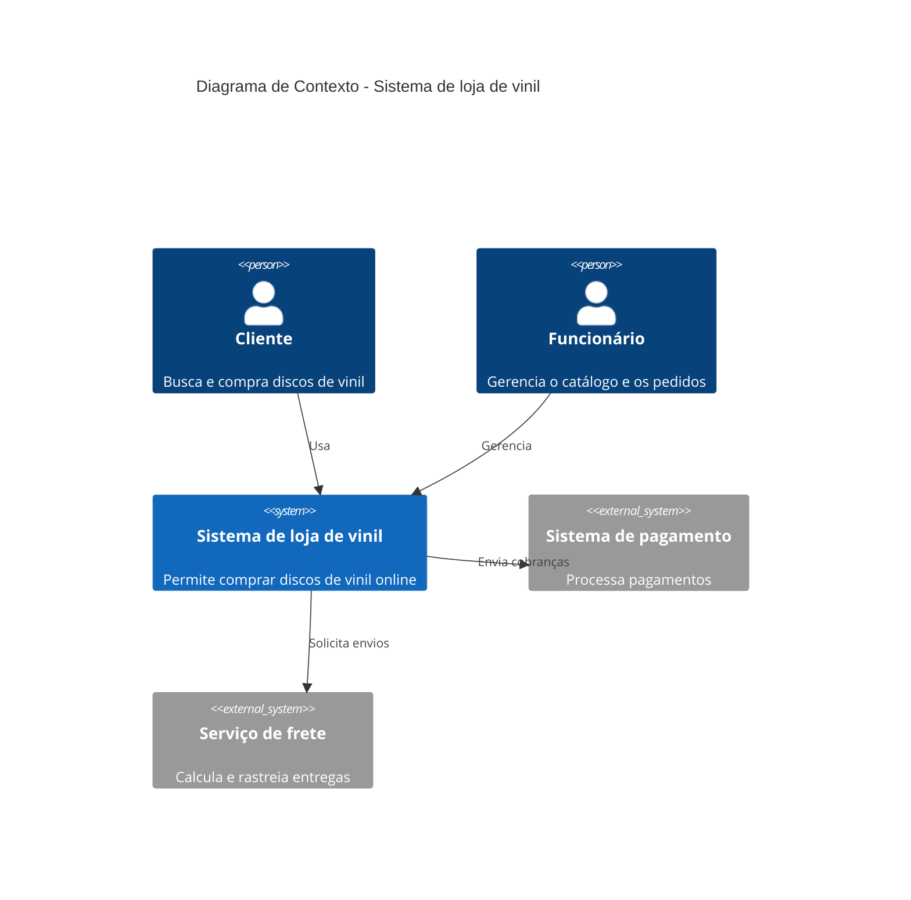
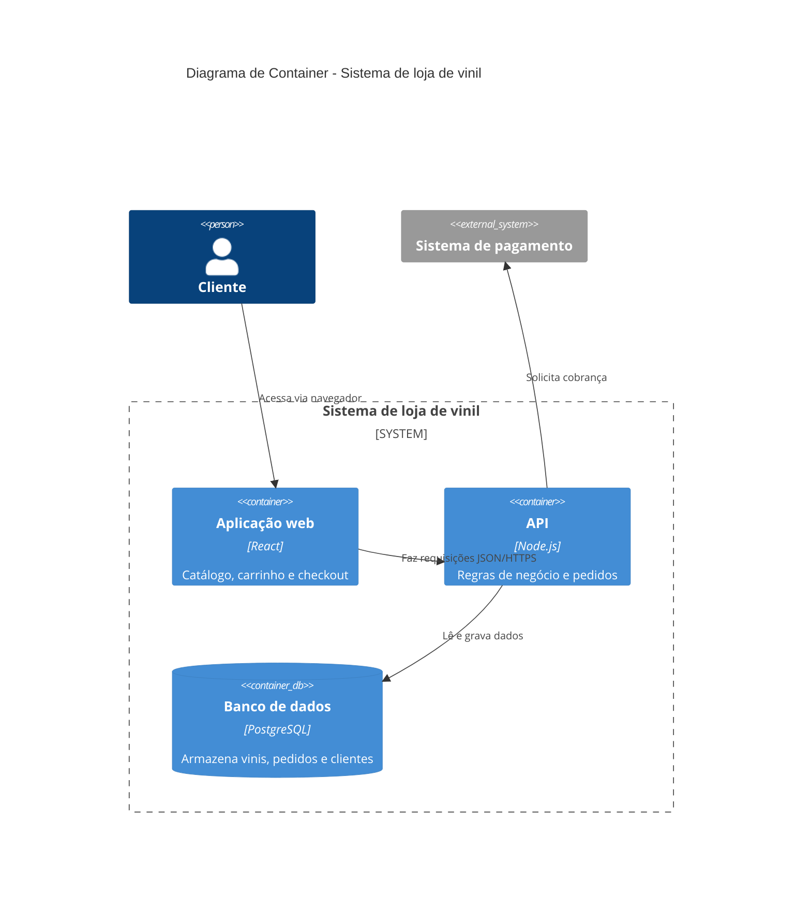
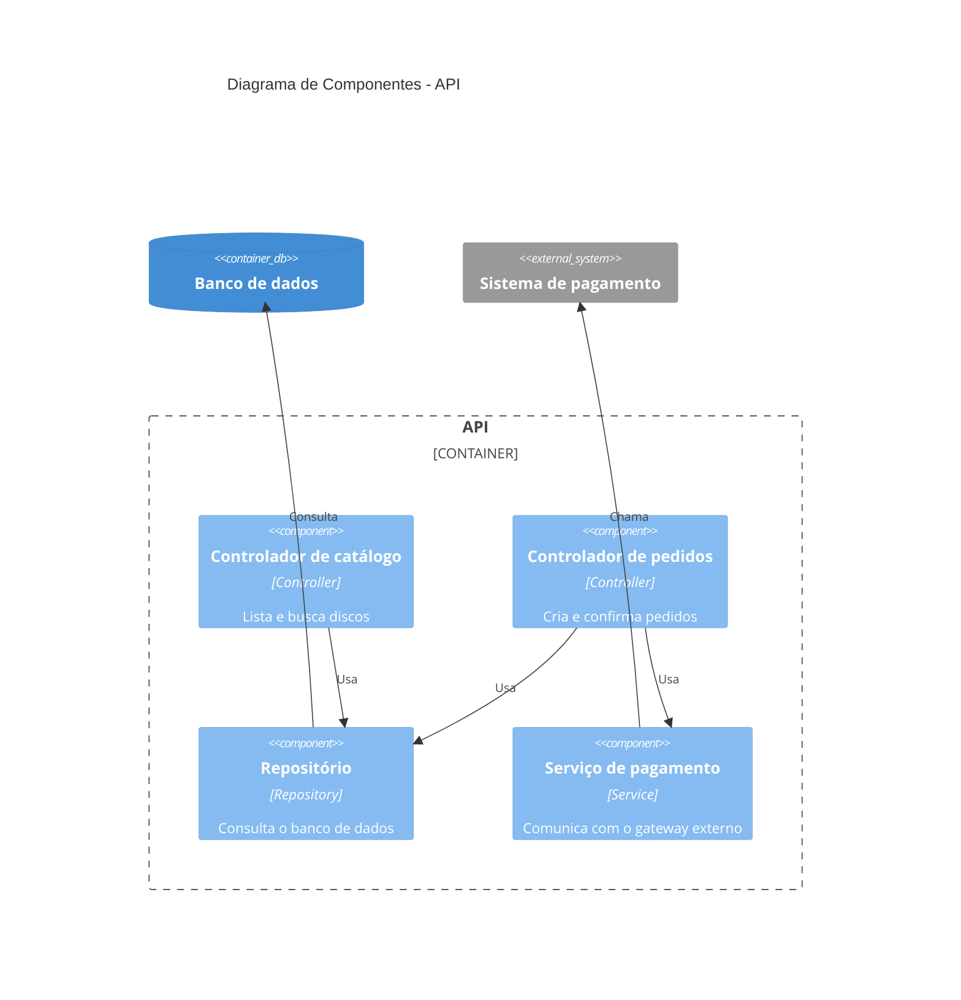
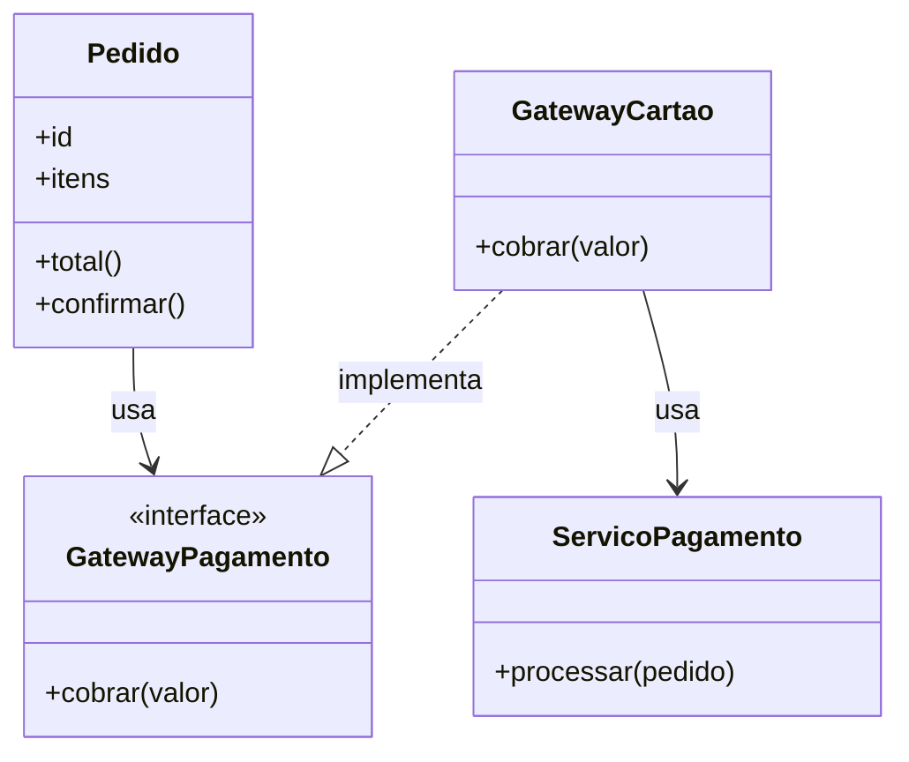

# C4 — Sistema de loja de vinil

Diagrama C4 completo (Contexto, Container, Componente e Código) do sistema, feito com Mermaid.

## Nível 1 — Contexto

## Nível 2 — Container

## Nível 3 — Componente

## Nível 4 — Código

