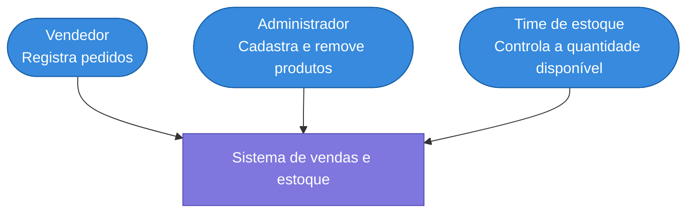
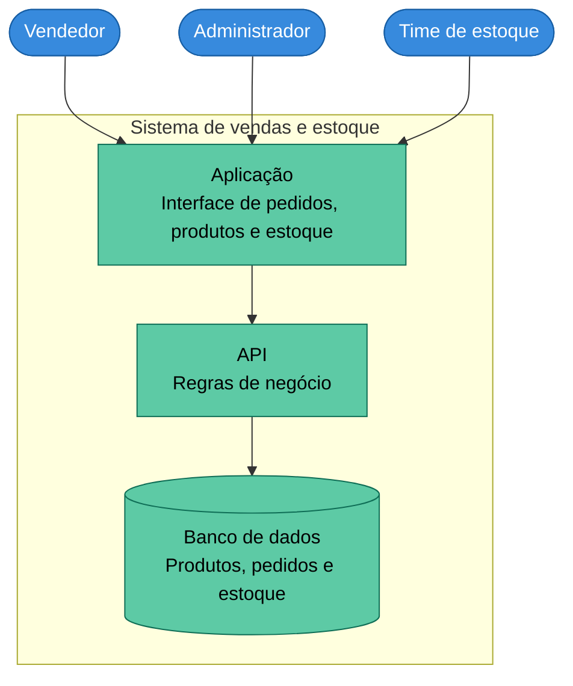
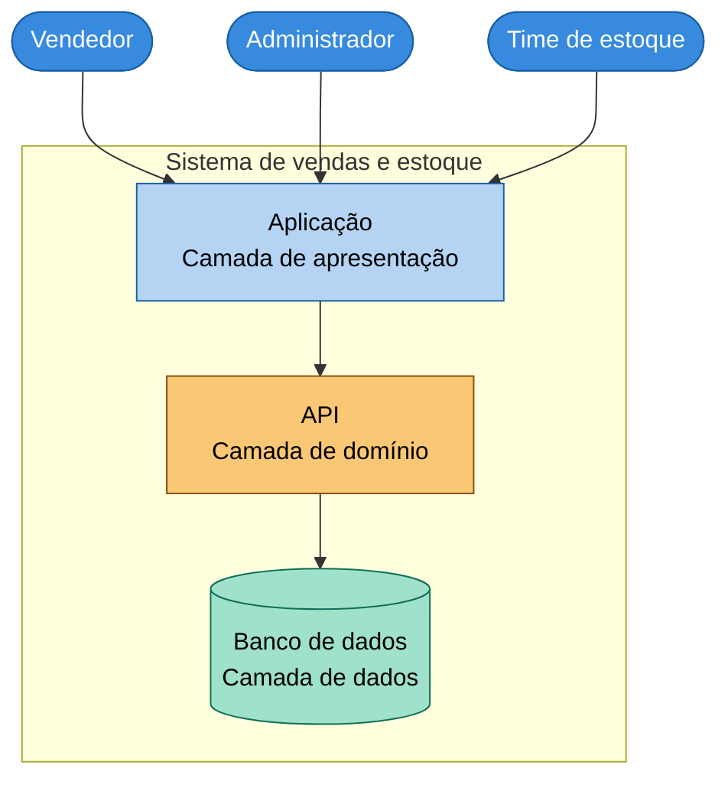

## 1. Diagrama C4 nível 1 (contexto)
 

 
## 2. Diagrama C4 nível 2 (contêineres)
 

 
## 3. Nível 2 anotado com as camadas
 

 
- **Apresentação**: a Aplicação, por onde vendedor, administrador e time de estoque interagem com o sistema.
- **Domínio**: a API, que concentra as regras de negócio (registrar pedido, cadastrar/remover produto, dar baixa ou registrar entrada de estoque).
- **Dados**: o Banco de dados, que armazena produtos, pedidos e o controle de estoque.
